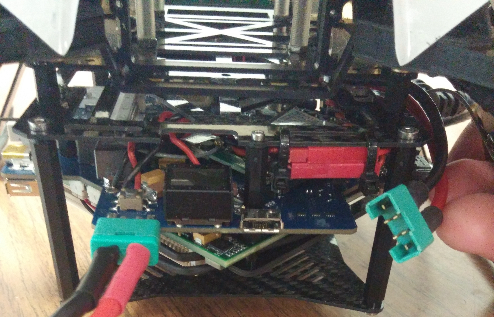
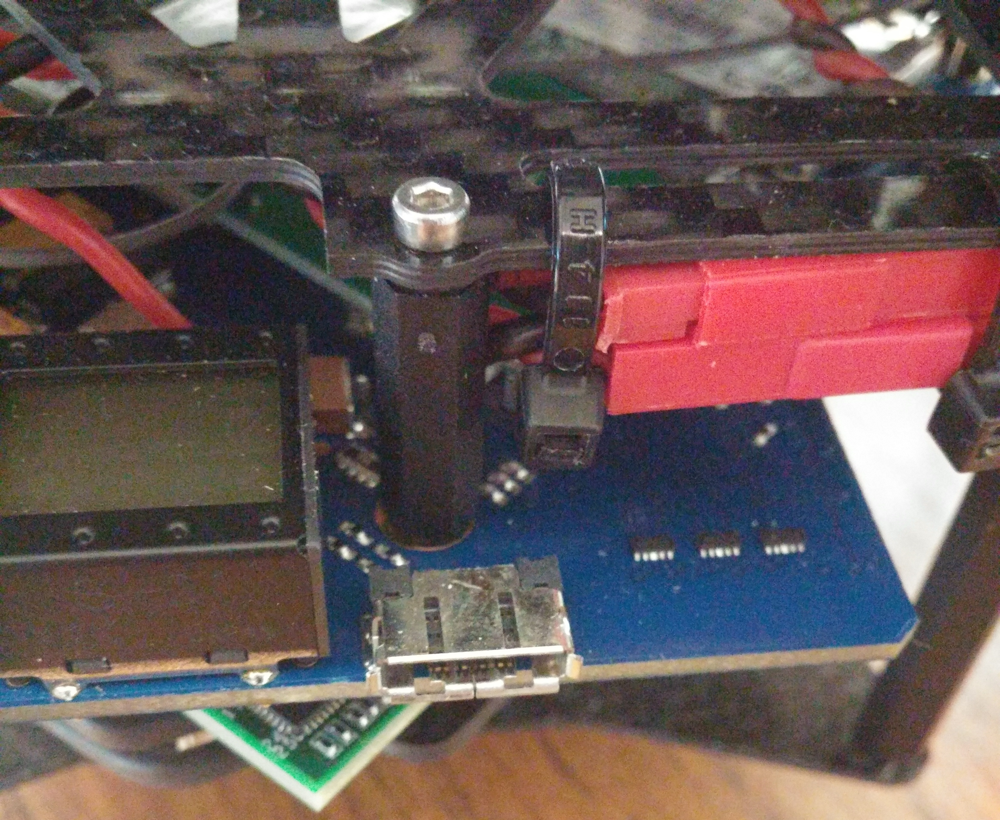
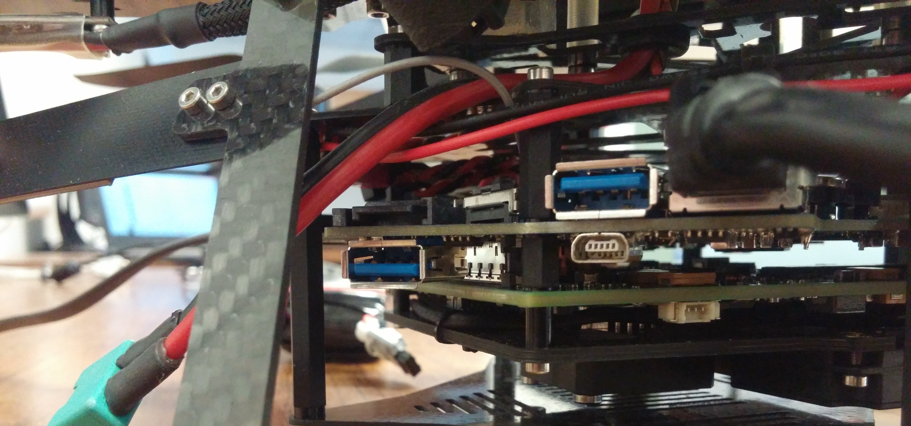

# Connecting to Monitor and Keyboard

This will go over how to connect a monitor and keyboard to the Mastermind on the Asctec Firefly. This allows you to setup and configure what runs on the Mastermind when it turns on.

* Connect a charged battery to either the terminal on the Mastermind board itself or to the flight controller
	* Note: For long operations you can connect a battery to both then disconnect the dead battery to charge.

* Using the VGA adapter connect to the Mastermind.

* Connect a USB keyboard to one of the USB 3.0 ports.
	* Note: The USB bus on the Mastermind is very limited and as such it is recommended to use a keyboard with a USB port so that you can use both a mouse and keyboard across one USB header. 

* Power on the Mastermind.
	* Note: If you get a CMOS Checksum Error just power cycle the system until it boots. This is cause by a watch battery on the Mastermind that has died and needs to be replaced.
* Once the boot has completed start the GUI with `sudo start lightdm` and when completed use `sudo init 0` to shut down the Mastermind.