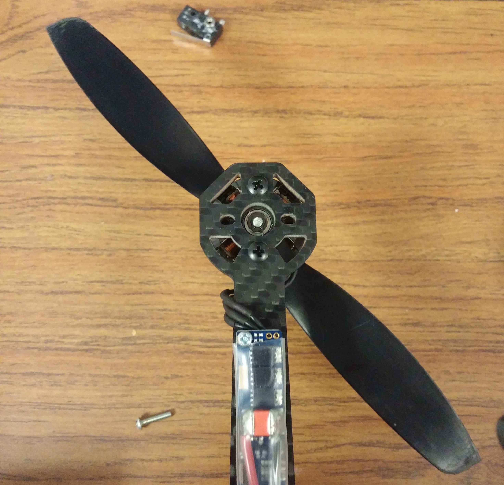
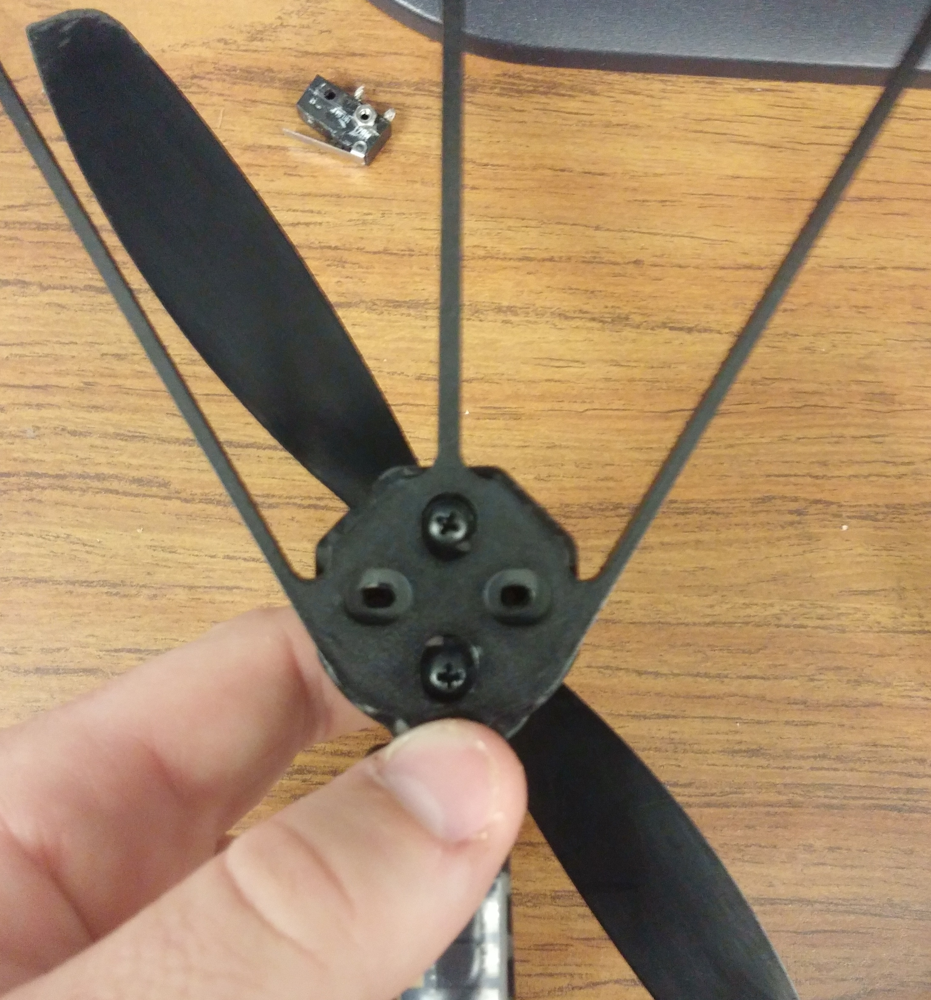
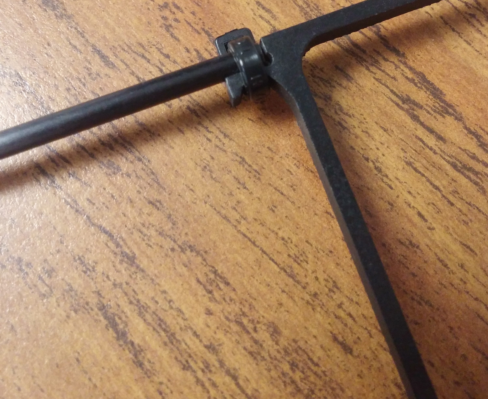
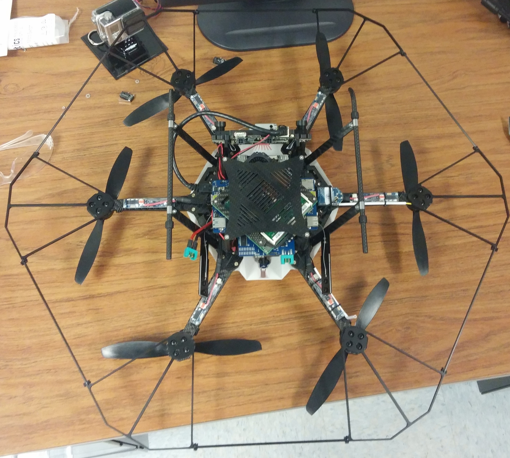

# Prop Guard Instillation

### Intro 
This will go over how to install the prop guard on the Asctec Firefly. The prop guard is intended for inside use and only minor bumps against a wall, it will NOT save it from a hard hit.

* Remove these two screws on each arm.

* Attach each guard so that the countersunk holes are facing you as seen below:

* Replace all of the screws that you removed, leave them about a quarter turn loose so that the guards have a little play.
* Attach the carbon fiber rods to the guards with zip ties.
	* Note: Plan to model an attachment clip for ease of use.

* Fully tighten the screws but be careful to not over tighten them.
